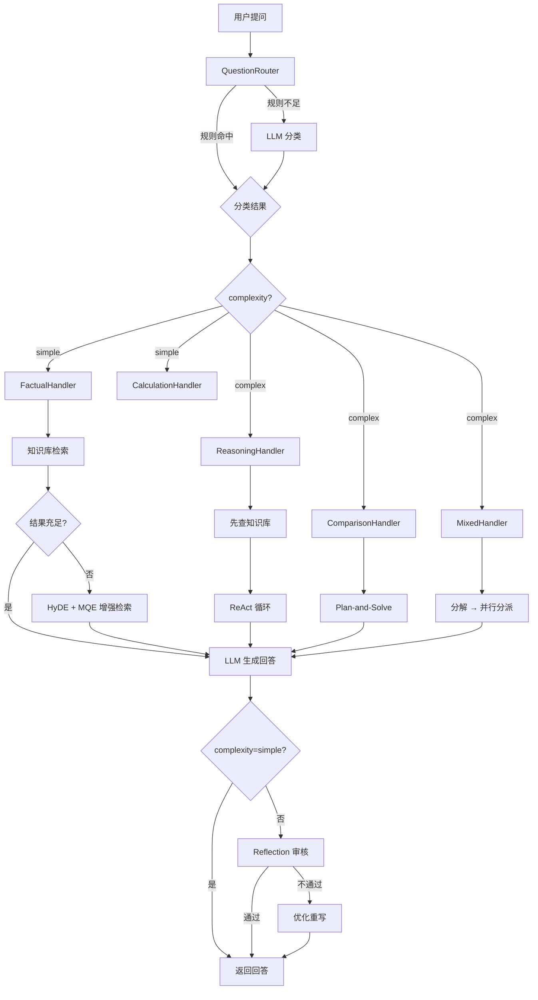
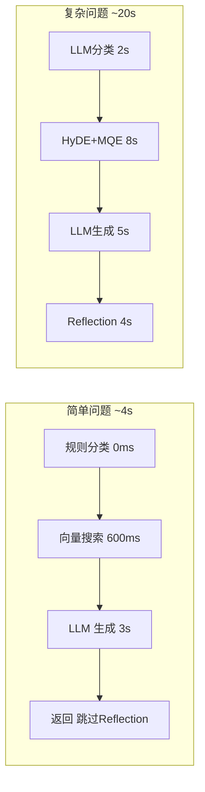
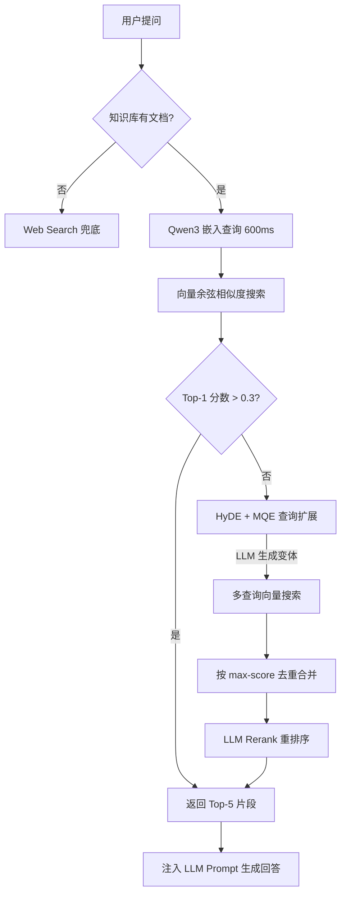
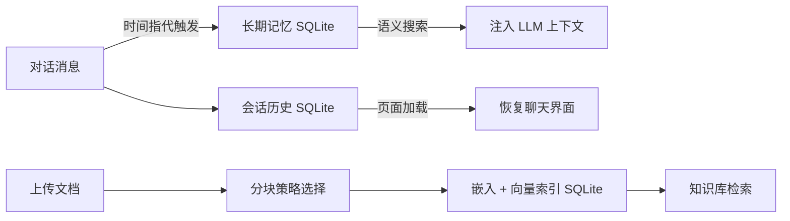

# Knowledge QA — 智能知识库问答系统

基于 **HelloAgents 多智能体框架** 构建的企业级 RAG 问答系统。上传知识文档，AI 基于文档内容精准回答，支持答案溯源、多会话管理、用户认证和长期记忆。

---

## 功能特性

| 模块 | 特性 | 状态 |
|------|------|:--:|
| 📚 **知识库管理** | 拖拽上传文档（TXT/PDF/MD），三种分块策略可选，自动向量化索引 | ✅ |
| 🔍 **语义检索** | Qwen3-Embedding-4B 向量搜索 + HyDE + MQE 查询扩展 + Rerank 重排序 | ✅ |
| 📎 **答案溯源** | 每个回答标注信息来源，无来源时明确告知用户 | ✅ |
| 💬 **多会话** | 创建/切换/删除会话，每会话独立历史，SQLite 持久化，重启不丢 | ✅ |
| 👤 **用户系统** | 注册/登录，JWT 认证，按用户隔离记忆和会话数据 | ✅ |
| 🧠 **长期记忆** | 对话原文存入 SQLite，带时间指代时语义搜索历史对话 | ✅ |
| ⚡ **策略路由** | 自动分类问题类型（事实/推理/对比/计算/复合），简单问题快速通道 | ✅ |
| ✂️ **多策略分块** | 固定字符 / 递归语义 / Markdown 标题三种分块策略 | ✅ |
| 📊 **评测系统** | 10 题标准评测集，检索召回率 + LLM Judge 评分 | ✅ |
| 📝 **操作日志** | 三层日志分离（全量/错误/上传），每日轮转，TIMING 链路追踪 | ✅ |

---

## 技术栈

| 层级 | 技术 |
|------|------|
| 前端 | React 18 + TypeScript + Vite + Zustand |
| 后端 | FastAPI + Uvicorn |
| 数据库 | SQLite（会话 / 记忆 / 知识库 / 用户） |
| 智能体 | HelloAgents Optimized |
| LLM | DeepSeek（OpenAI 兼容） |
| 嵌入模型 | Qwen3-Embedding-4B（2560d，本地 CPU） |

---

## 快速开始

### 环境要求

- Python ≥ 3.10
- Node.js ≥ 18

### 1. 配置

```bash
cd backend
cp .env.example .env
```

编辑 `.env`，填入 LLM API Key：

```env
LLM_API_KEY=sk-your-key
```

### 2. 启动后端

```bash
cd backend
pip install -r requirements.txt
python -m app.main
```

启动时后台预加载 Qwen3 嵌入模型（约 20s），期间可正常接受请求。API 文档：http://localhost:8566/api/docs

### 3. 启动前端

```bash
cd frontend
npm install
npm run dev
```

访问 http://localhost:5173，前端自动读取后端端口配置。

### 4. 开始使用

1. 注册账号 → 登录
2. 左侧「知识库」→ 选择分块策略 → 拖拽上传文档
3. 「会话」→ 新建会话 → 开始提问

---

## 智能体协作流程



### 简单 vs 复杂



---

## 检索流程



## 记忆系统



| 类型 | 存储 | 触发条件 |
|------|------|----------|
| 会话历史 | SQLite `conversations`/`messages` | 所有对话自动记录 |
| 长期记忆 | SQLite `memories` | 用户说"上次/刚才/之前"时语义搜索 |
| 知识库索引 | SQLite `doc_chunks` | 上传文档时嵌入存储 |

---

## API 路由

| 方法 | 路径 | 说明 |
|------|------|------|
| POST | `/api/v1/auth/register` | 注册 |
| POST | `/api/v1/auth/login` | 登录 |
| POST | `/api/v1/chat/stream` | 流式聊天 |
| POST | `/api/v1/chat` | 同步聊天 |
| POST | `/api/v1/chat/conversations` | 新建会话 |
| GET | `/api/v1/chat/conversations` | 会话列表 |
| DELETE | `/api/v1/chat/conversations/{id}` | 删除会话 |
| GET | `/api/v1/chat/{id}/history` | 会话历史 |
| POST | `/api/v1/documents/upload` | 上传文档 |
| GET | `/api/v1/documents` | 文档列表 |
| GET | `/api/v1/documents/{id}/chunks` | 查看分块 |
| DELETE | `/api/v1/documents/{id}` | 删除文档 |
| GET | `/api/v1/health` | 健康检查 |

---

## 项目结构

```
helloagents-qa/
├── backend/
│   ├── app/
│   │   ├── main.py                 # FastAPI 入口，后台预加载模型
│   │   ├── config.py               # Pydantic Settings
│   │   ├── api/routes/
│   │   │   ├── chat.py             # 聊天 + 会话管理
│   │   │   ├── documents.py        # 文档 CRUD + 分块查看
│   │   │   ├── health.py           # 健康检查
│   │   │   └── admin.py            # 系统统计
│   │   ├── auth/                   # JWT 认证 + SQLite 用户库
│   │   ├── core/
│   │   │   ├── agent.py            # AdvancedQAAgent 编排器
│   │   │   ├── router.py           # QuestionRouter（规则+LLM）
│   │   │   ├── verifier.py         # ReflectionVerifier
│   │   │   └── handlers/           # 五种处理策略
│   │   ├── knowledge/
│   │   │   ├── manager.py          # 知识库 + 记忆 + 三种分块策略
│   │   │   └── embedding.py        # Qwen3-Embedding-4B 模块
│   │   ├── tools/                  # WebSearch + Calculator
│   │   ├── memory/                 # SQLite 会话持久化
│   │   └── utils/                  # 日志 / 异常 / 中间件
│   ├── evaluate.py                 # 评测脚本
│   ├── eval_via_api.py             # API 模式评测（推荐）
│   ├── data/                       # SQLite 数据库文件
│   └── logs/                       # 日志（每日轮转 30 天）
│       ├── qa_backend.log
│       ├── qa_backend_error.log
│       └── upload.log
├── frontend/
│   ├── src/
│   │   ├── components/
│   │   │   ├── chat/               # 聊天界面（气泡/输入/Markdown）
│   │   │   ├── trace/              # 推理追踪（时间线/工具调用）
│   │   │   └── layout/             # 侧边栏（会话+知识库标签）
│   │   ├── pages/                  # 登录/注册/聊天页
│   │   ├── store/                  # Zustand 状态管理
│   │   ├── hooks/                  # useChat
│   │   └── services/               # API 客户端 + SSE 解析
│   └── vite.config.ts              # 自动读取后端端口
├── README.md
├── DESIGN.md
└── 企业知识文档.txt                 # 示例知识文档
```

---

## 评测

```bash
cd backend

# API 模式（推荐，复用已加载的模型）
python eval_via_api.py

# 独立进程模式
python evaluate.py
```

评测结果示例（企业知识文档，10 题）：

| 指标 | 数值 |
|------|:----:|
| 检索召回率 | 66% |
| Judge 评分 | 4.7/5 |
| 来源标注率 | 10/10 |
| 平均耗时 | 4.2s |

---

## 环境变量

| 变量 | 必需 | 默认值 | 说明 |
|------|:--:|--------|------|
| `LLM_API_KEY` | ✅ | — | LLM API Key |
| `LLM_MODEL_ID` | — | `deepseek-chat` | 模型名称 |
| `LLM_BASE_URL` | — | DeepSeek | API 地址 |
| `PORT` | — | `8566` | 后端端口 |
| `LOG_FORMAT` | — | `json` | 日志格式（text/json） |
| `REFLECTION_ENABLED` | — | `true` | 复杂问题反思 |

---

## 致谢

- 感谢 [Hello-Agents](https://github.com/datawhalechina/hello-agents) 提供的多智能体框架
- 感谢 Qwen3-Embedding-4B 提供嵌入模型支持
